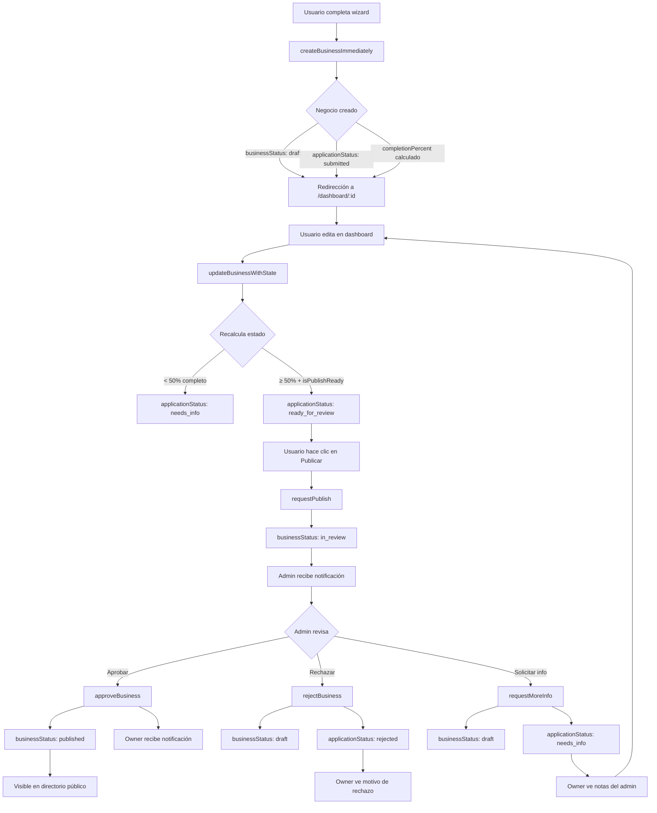

# Arquitectura del Sistema de Registro de Negocios

## 📋 Tabla de Contenidos
- [Descripción General](#descripción-general)
- [Máquina de Estados](#máquina-de-estados)
- [Flujo de Usuario](#flujo-de-usuario)
- [Cálculo de Completitud](#cálculo-de-completitud)
- [Acciones del Sistema](#acciones-del-sistema)
- [Reglas de Seguridad](#reglas-de-seguridad)
- [Notificaciones](#notificaciones)
- [Migración](#migración)

---

## Descripción General

El sistema de registro ha sido rediseñado para eliminar fricción y aumentar conversiones, permitiendo que los usuarios accedan inmediatamente a su dashboard después del registro, sin esperar aprobación del admin.

### Conceptos Clave

1. **Acceso Inmediato**: El usuario completa el wizard → negocio creado automáticamente en estado `draft` → redirección instantánea al dashboard
2. **Doble Estado**: Separación entre el estado del negocio (`businessStatus`) y el estado de la solicitud de aprobación (`applicationStatus`)
3. **Completitud Automática**: El sistema calcula automáticamente el porcentaje de completitud y los campos faltantes
4. **Publicación Controlada**: Solo negocios que cumplen requisitos mínimos pueden solicitar publicación

---

## Máquina de Estados

### businessStatus (Estado del Negocio)

Control de visibilidad pública del negocio:

```typescript
type BusinessStatus = 'draft' | 'in_review' | 'published';
```

**Transiciones:**
```
draft → in_review  (usuario solicita publicación con botón "Publicar mi negocio")
in_review → published  (admin aprueba)
in_review → draft  (admin rechaza o solicita más información)
published → draft  (admin despublica por incumplimiento)
```

**Reglas:**
- `draft`: Solo visible para el owner y admin
- `in_review`: Visible para owner y admin, en cola de revisión
- `published`: Visible públicamente en el directorio

### applicationStatus (Estado de la Solicitud)

Control del flujo de aprobación administrativa:

```typescript
type ApplicationStatus = 
  | 'submitted'        // Usuario envió solicitud inicial
  | 'needs_info'       // Admin solicita más información
  | 'ready_for_review' // Completitud ≥50%, listo para revisión
  | 'approved'         // Admin aprobó
  | 'rejected';        // Admin rechazó
```

**Transiciones Automáticas:**
```
submitted → needs_info  (si completionPercent < 50%)
submitted → ready_for_review  (si completionPercent ≥ 50% y isPublishReady = true)
needs_info → ready_for_review  (cuando usuario completa campos y alcanza 50%+)
```

**Transiciones Manuales (Admin):**
```
ready_for_review → approved  (admin aprueba)
ready_for_review → rejected  (admin rechaza)
ready_for_review → needs_info  (admin solicita más info)
needs_info → approved  (admin decide aprobar directamente)
```

### Relación Entre Estados

| businessStatus | applicationStatus | Significado |
|----------------|-------------------|-------------|
| `draft` | `submitted` | Recién creado, esperando que usuario complete |
| `draft` | `needs_info` | Admin solicitó más información |
| `draft` | `ready_for_review` | Listo pero usuario no ha solicitado publicación |
| `in_review` | `ready_for_review` | Usuario solicitó publicación, esperando admin |
| `published` | `approved` | Aprobado y visible públicamente |
| `draft` | `rejected` | Rechazado por admin |

---

## Flujo de Usuario

### 1. Registro Inicial (BusinessWizard)

```typescript
// components/BusinessWizard.tsx
const handleFinalSubmit = async (data) => {
  const result = await createBusinessImmediately(wizardData);
  // result contiene:
  // - businessId: ID del negocio creado
  // - redirectUrl: '/dashboard/{businessId}'
  // - businessStatus: 'draft'
  // - applicationStatus: 'submitted'
  // - completionPercent: calculado automáticamente
  
  router.push(result.redirectUrl); // Redirección inmediata
};
```

**Campos creados inicialmente:**
- ✅ Información básica del wizard (nombre, categoría, contacto)
- ✅ `businessStatus: 'draft'`
- ✅ `applicationStatus: 'submitted'`
- ✅ `completionPercent`: calculado según campos completados
- ✅ `isPublishReady`: false (hasta que cumpla requisitos mínimos)
- ✅ `missingFields`: array de campos faltantes

### 2. Dashboard de Edición (DashboardEditor)

El usuario ve un banner de estado con:
- **Barra de progreso** visual del porcentaje de completitud
- **Lista de campos faltantes** para alcanzar el mínimo publicable
- **Botón de publicación** (habilitado solo si `isPublishReady: true`)

```tsx
<BusinessStatusBanner
  businessStatus={business.businessStatus}
  applicationStatus={business.applicationStatus}
  completionPercent={business.completionPercent}
  missingFields={business.missingFields}
  isPublishReady={business.isPublishReady}
  onPublish={handleRequestPublish}
/>
```

### 3. Solicitud de Publicación

Cuando el usuario hace clic en "🚀 Publicar mi negocio":

```typescript
// app/actions/businessActions.ts
async function requestPublish(businessId: string) {
  // Valida que isPublishReady = true
  // Cambia businessStatus: 'in_review'
  // applicationStatus se mantiene o actualiza a 'ready_for_review'
  // Envía notificación al admin
}
```

### 4. Revisión del Admin

Admin tiene 3 vistas filtradas:

**Vista "Nuevas Solicitudes"** (`applicationStatus: 'submitted'`):
```typescript
const newSubmissions = await getNewSubmissions();
// Negocios recién creados, esperando primera revisión
```

**Vista "Pendientes"** (`applicationStatus: 'needs_info'`):
```typescript
const pending = await getPendingBusinesses();
// Negocios que necesitan más información del usuario
```

**Vista "Listos para Publicar"** (`applicationStatus: 'ready_for_review'`):
```typescript
const ready = await getReadyForReview();
// Negocios completos esperando aprobación final
```

**Acciones disponibles:**
```typescript
// Aprobar (publica inmediatamente)
await approveBusiness(businessId);
// → businessStatus: 'published'
// → applicationStatus: 'approved'
// → Envía notificación por WhatsApp/correo al owner

// Rechazar (con motivo)
await rejectBusiness(businessId, reason);
// → businessStatus: 'draft'
// → applicationStatus: 'rejected'
// → rejectionReason guardado para que usuario lo vea

// Solicitar más información
await requestMoreInfo(businessId, notes);
// → businessStatus: 'draft'
// → applicationStatus: 'needs_info'
// → adminNotes guardadas para guiar al usuario
```

---

## Cálculo de Completitud

### Sistema de Pesos (Total 100%)

**Campos Críticos (60%):**
- `name`: 10%
- `category`: 10%
- `location` (address + coordinates): 10%
- `contact` (phone o WhatsApp): 10%
- `description`: 10%
- `horarios`: 10%

**Campos Importantes (40%):**
- `logo`: 15%
- `coverImage`: 10%
- `gallery`: 5% (mínimo 1 imagen)
- `socialMedia` (Facebook o Instagram): 5%
- `detailedInfo` (servicios/productos): 5%

### Función de Cálculo

```typescript
// lib/businessStates.ts
function computeProfileCompletion(business: Business): number {
  let score = 0;
  
  if (business.name?.trim()) score += 10;
  if (business.category?.trim()) score += 10;
  if (business.address && business.lat && business.lng) score += 10;
  if (business.phone || business.WhatsApp) score += 10;
  if (business.description && business.description.length >= 50) score += 10;
  if (validHorarios(business.horarios)) score += 10;
  if (business.logoUrl) score += 15;
  if (business.coverImageUrl) score += 10;
  if (business.gallery && business.gallery.length > 0) score += 5;
  if (business.facebook || business.instagram) score += 5;
  if (business.servicios?.length > 0 || business.productos?.length > 0) score += 5;
  
  return score;
}
```

### Requisitos Mínimos para Publicación

```typescript
function isPublishReady(business: Business): boolean {
  return (
    business.name?.trim().length > 0 &&
    business.category?.trim().length > 0 &&
    business.address && business.lat && business.lng &&
    (business.phone || business.WhatsApp) &&
    business.description && business.description.length >= 50 &&
    validHorarios(business.horarios) // Al menos 1 día con horarios
  );
}
```

**Campos obligatorios:**
1. ✅ Nombre del negocio
2. ✅ Categoría
3. ✅ Ubicación completa (dirección + coordenadas)
4. ✅ Al menos un método de contacto (teléfono o WhatsApp)
5. ✅ Descripción de al menos 50 caracteres
6. ✅ Horarios de al menos 1 día

### Actualización Automática

Cada vez que el usuario edita el negocio:

```typescript
// app/actions/businessActions.ts
async function updateBusinessWithState(businessId, updates) {
  // 1. Guardar cambios del usuario
  await firestore.collection('businesses').doc(businessId).update(updates);
  
  // 2. Recalcular estado automáticamente
  const updatedBusiness = await getBusiness(businessId);
  const newState = updateBusinessState(updatedBusiness);
  
  // 3. Actualizar campos computados
  await firestore.collection('businesses').doc(businessId).update({
    completionPercent: newState.completionPercent,
    isPublishReady: newState.isPublishReady,
    missingFields: newState.missingFields,
    applicationStatus: newState.applicationStatus
  });
}
```

---

## Acciones del Sistema

### Acciones del Usuario

#### `createBusinessImmediately(data)`
**Ubicación:** `app/actions/businessActions.ts`

Crea el negocio inmediatamente después del wizard:
```typescript
const result = {
  businessId: string,
  redirectUrl: `/dashboard/${businessId}`,
  businessStatus: 'draft',
  applicationStatus: 'submitted',
  completionPercent: number,
  isPublishReady: boolean
};
```

#### `updateBusinessWithState(businessId, updates)`
**Ubicación:** `app/actions/businessActions.ts`

Actualiza campos y recalcula estado automáticamente.

#### `requestPublish(businessId)`
**Ubicación:** `app/actions/businessActions.ts`

Solicita publicación (requiere `isPublishReady: true`):
- Cambia `businessStatus: 'in_review'`
- Notifica al admin por WhatsApp/Slack
- Muestra mensaje de confirmación al usuario

### Acciones del Admin

#### `getNewSubmissions()`
**Ubicación:** `app/actions/adminBusinessActions.ts`

Lista negocios con `applicationStatus: 'submitted'`.

#### `getPendingBusinesses()`
**Ubicación:** `app/actions/adminBusinessActions.ts`

Lista negocios con `applicationStatus: 'needs_info'` o `completionPercent < 50%`.

#### `getReadyForReview()`
**Ubicación:** `app/actions/adminBusinessActions.ts`

Lista negocios con `applicationStatus: 'ready_for_review'` y `businessStatus: 'in_review'`.

#### `approveBusiness(businessId)`
**Ubicación:** `app/actions/adminBusinessActions.ts`

Aprueba y publica el negocio:
- `businessStatus: 'published'`
- `applicationStatus: 'approved'`
- Envía notificación de aprobación al owner
- Actualiza `publishedAt` timestamp

#### `rejectBusiness(businessId, reason)`
**Ubicación:** `app/actions/adminBusinessActions.ts`

Rechaza el negocio con motivo:
- `businessStatus: 'draft'`
- `applicationStatus: 'rejected'`
- Guarda `rejectionReason` para que el usuario lo vea
- Envía notificación de rechazo al owner

#### `requestMoreInfo(businessId, notes)`
**Ubicación:** `app/actions/adminBusinessActions.ts`

Solicita información adicional:
- `businessStatus: 'draft'`
- `applicationStatus: 'needs_info'`
- Guarda `adminNotes` con instrucciones específicas
- Envía notificación al owner

#### `unpublishBusiness(businessId, reason)`
**Ubicación:** `app/actions/adminBusinessActions.ts`

Despublica un negocio ya publicado:
- `businessStatus: 'draft'`
- Guarda `unpublishReason`
- Notifica al owner

---

## Reglas de Seguridad

### Firestore Rules

#### Validación de Estados

```javascript
// firestore.rules
function validBusinessStatus(val) {
  return val in ['draft', 'in_review', 'published'];
}

function validApplicationStatus(val) {
  return val in ['submitted', 'needs_info', 'ready_for_review', 'approved', 'rejected'];
}
```

#### Permisos de Lectura

```javascript
// businesses/{businessId}
allow get: if (
  resource.data.businessStatus == 'published' || // Público si está publicado
  isOwner(businessId) ||                         // Owner siempre puede ver
  isAdmin()                                      // Admin siempre puede ver
);

allow list: if isAdmin() ||                      // Admin puede listar todo
               isSignedIn() ||                   // Usuarios autenticados pueden listar
               (request.query.businessStatus == 'published'); // Público solo ve published
```

#### Permisos de Escritura

**Creación por usuario:**
```javascript
allow create: if (
  request.resource.data.ownerId == request.auth.uid &&
  request.resource.data.businessStatus == 'draft' &&
  validApplicationStatus(request.resource.data.applicationStatus)
);
```

**Actualización por owner:**
```javascript
allow update: if (
  isOwner(businessId) &&
  // Solo puede editar draft o in_review, NO published
  (resource.data.businessStatus in ['draft', 'in_review']) &&
  // No puede cambiar businessStatus a 'published' directamente
  request.resource.data.businessStatus != 'published' &&
  // No puede modificar applicationStatus (lo hace el sistema)
  request.resource.data.applicationStatus == resource.data.applicationStatus
);
```

**Actualización por admin:**
```javascript
allow update: if (
  isAdmin() &&
  validBusinessStatus(request.resource.data.businessStatus) &&
  validApplicationStatus(request.resource.data.applicationStatus)
);
```

---

## Notificaciones

### Sistema de Notificaciones WhatsApp

#### Trigger: Wizard Completado
**Endpoint:** `POST /api/notify/wizard-complete`

Cuando el usuario completa el wizard:
```typescript
// Idempotencia: solo envía una vez por businessId
const notificationId = `${businessId}_wizardcomplete`;
if (await checkNotificationSent(notificationId)) {
  return { already_sent: true };
}

// Envío con fallback de proveedores
await sendWhatsApp({
  to: ADMIN_WHATSAPP_TO,
  message: formatWizardCompleteMessage(business)
});

// Log en Firestore
await saveNotificationLog(notificationId, result);
```

**Proveedores soportados:**
1. **Twilio WhatsApp API** (producción, requiere cuenta Business)
2. **CallMeBot API** (desarrollo, gratis, requiere activación)

**Fallback:** Si WhatsApp falla, envía notificación a Slack webhook.

#### Trigger: Solicitud de Publicación
```typescript
// Cuando usuario hace clic en "Publicar mi negocio"
await sendWhatsApp({
  message: `📤 ${business.name} solicitó publicación\nCompletitud: ${completionPercent}%`
});
```

#### Trigger: Aprobación/Rechazo
```typescript
// Admin aprueba
await sendWhatsApp({
  to: business.ownerPhone,
  message: `✅ Tu negocio ${business.name} ha sido aprobado y publicado`
});

// Admin rechaza
await sendWhatsApp({
  to: business.ownerPhone,
  message: `❌ Tu negocio fue rechazado: ${rejectionReason}`
});
```

---

## Migración

### Script de Migración

**Ubicación:** `scripts/migrate-business-states.ts`

Ejecutar una sola vez para migrar de sistema antiguo al nuevo:

```bash
npm run migrate:business-states
```

**Funciones:**

1. **`mapOldToNewStatus()`**: Mapea status antiguo → nuevo
   ```typescript
   'draft' → businessStatus: 'draft', applicationStatus: 'submitted'
   'review' → businessStatus: 'in_review', applicationStatus: 'ready_for_review'
   'published' → businessStatus: 'published', applicationStatus: 'approved'
   'rejected' → businessStatus: 'draft', applicationStatus: 'rejected'
   ```

2. **`migrateBatch()`**: Procesa negocios existentes en lotes de 500
   - Calcula `completionPercent` para cada negocio
   - Determina `isPublishReady` según campos presentes
   - Identifica `missingFields` para guiar al usuario
   - Actualiza Firestore sin cambiar `status` antiguo (compatibilidad)

3. **`createMissingBusinesses()`**: Crea documentos de negocios para applications huérfanas
   - Busca applications sin negocio asociado
   - Crea business en estado `draft` con datos de la application
   - Vincula application con el nuevo businessId

### Comandos de Prueba

**Test de notificaciones WhatsApp:**
```bash
npm run test:whatsapp
```

Verifica configuración de proveedores y envía mensaje de prueba.

---

## Diagrama de Flujo Completo



---

## Resumen de Cambios

### ✅ Antes (Sistema Antiguo)
- Usuario completa wizard → espera aprobación del admin → recibe email → accede al dashboard
- Alto abandono por fricción
- Sin feedback de completitud
- Un solo campo `status` mezclando visibilidad y flujo de aprobación

### 🚀 Después (Sistema Nuevo)
- Usuario completa wizard → acceso inmediato al dashboard → completa a su ritmo → solicita publicación cuando está listo
- Retroalimentación constante (progreso visual)
- Separación clara: `businessStatus` (visibilidad) + `applicationStatus` (aprobación)
- Admin tiene colas organizadas por estado de completitud
- Notificaciones automáticas en cada transición

---

## Archivos Clave

**Estado y Lógica:**
- `lib/businessStates.ts` - Máquina de estados, cálculo de completitud
- `types/business.ts` - Tipos TypeScript actualizados

**Server Actions:**
- `app/actions/businessActions.ts` - Acciones del usuario
- `app/actions/adminBusinessActions.ts` - Acciones del admin

**Componentes UI:**
- `components/BusinessWizard.tsx` - Wizard con redirección inmediata
- `components/DashboardEditor.tsx` - Editor con banner de estado
- `components/BusinessStatusBanner.tsx` - Banner de progreso

**Reglas y Migración:**
- `firestore.rules` - Reglas de seguridad actualizadas
- `scripts/migrate-business-states.ts` - Script de migración

**Notificaciones:**
- `lib/whatsapp/adapters.ts` - Adaptadores multi-proveedor
- `lib/whatsapp/notificationService.ts` - Servicio con idempotencia
- `app/api/notify/wizard-complete/route.ts` - Endpoint seguro

---

## Próximos Pasos

1. ✅ Deploy de Firestore rules: `firebase deploy --only firestore:rules`
2. ⏳ Crear UI del panel de admin con 3 tabs
3. ⏳ Integrar `BusinessStatusBanner` en `DashboardEditor`
4. ⏳ Testing completo del flujo end-to-end
5. ⏳ Ejecutar migración en producción (después de backup)
6. ⏳ Monitorear métricas de conversión post-lanzamiento
