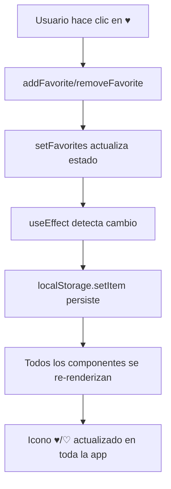

# Corrección: Persistencia de Favoritos entre Navegaciones

## Problema Identificado

Los favoritos no persistían correctamente al navegar entre páginas. Específicamente:

1. **Home → Favoritos → Home**: Al regresar al home, los favoritos se desmarcaban
2. **Página /negocios**: No se podían agregar favoritos

## Causa Raíz

### Múltiples Contextos Anidados

La aplicación tenía **`FavoritesProvider` duplicado** en múltiples ubicaciones:

```tsx
// ❌ ANTES: Provider raíz en Providers.tsx
<FavoritesProvider>{children}</FavoritesProvider>

// ❌ ANTES: Provider duplicado en app/page.tsx (HomeClient)
<FavoritesProvider>
  <BusinessCardVertical />
</FavoritesProvider>

// ❌ ANTES: Provider duplicado en app/negocios/page.tsx
<FavoritesProvider>
  <NegociosListClient />
</FavoritesProvider>

// ❌ ANTES: Provider duplicado en app/favoritos/page.tsx
<FavoritesProvider>
  <FavoritosClient />
</FavoritesProvider>
```

### Consecuencias del Problema

1. **Contextos Anidados Independientes**: Cada página creaba su propio contexto de favoritos
2. **Reinicialización en Navegación**: Al cambiar de ruta, React desmontaba el contexto interno y montaba uno nuevo
3. **Estado Temporal**: El nuevo contexto iniciaba con `favorites: []` vacío
4. **Race Condition**: Aunque el `useEffect` cargaba localStorage, React ya había renderizado con el estado vacío inicial
5. **Pérdida de Sincronización**: Los cambios en una página no se reflejaban en otras

## Solución Implementada

### Único Provider Global

Se eliminaron todos los `FavoritesProvider` duplicados en páginas individuales, manteniendo **solo el provider raíz** en `components/Providers.tsx`:

```tsx
// ✅ DESPUÉS: Solo un provider en el layout raíz
// components/Providers.tsx (usado en app/layout.tsx)
export default function Providers({ children }: { children: React.ReactNode }) {
  return (
    <>
      <Script src="..." />
      <FavoritesProvider>{children}</FavoritesProvider>
    </>
  );
}
```

### Archivos Modificados

1. **`components/HomeClient.tsx`**: ❌ Eliminado `<FavoritesProvider>`
2. **`app/negocios/page.tsx`**: ❌ Eliminado `<FavoritesProvider>` e import
3. **`app/favoritos/page.tsx`**: ❌ Eliminado `<FavoritesProvider>` e import

## Ventajas de la Solución

### ✅ Persistencia Global
- Un solo contexto compartido por toda la aplicación
- El estado se mantiene al navegar entre páginas

### ✅ Sincronización Automática
- Los cambios en favoritos se reflejan inmediatamente en todas las vistas
- No hay inconsistencias entre páginas

### ✅ Carga Única
- localStorage se lee solo una vez al montar la aplicación
- Mejor rendimiento, sin cargas repetidas

### ✅ Hidratación Correcta
- El provider se monta una sola vez en el layout raíz
- Evita problemas de hidratación SSR

## Arquitectura Resultante

```
app/layout.tsx
  ├── Providers (components/Providers.tsx)
  │   └── <FavoritesProvider> ⭐ ÚNICO PROVIDER
  │       └── {children}
  │           ├── app/page.tsx → HomeClient → BusinessCardVertical
  │           ├── app/negocios/page.tsx → NegociosListClient → BusinessCard
  │           └── app/favoritos/page.tsx → FavoritosClient
```

## Componentes que Usan Favoritos

Todos estos componentes usan `useFavorites()` y ahora comparten el mismo contexto:

1. **`BusinessCardVertical`** (home): Botón de favoritos con ♥/♡
2. **`BusinessCard`** (/negocios): Botón de favoritos con ♥/♡
3. **`FavoritosClient`** (/favoritos): Lista de negocios favoritos
4. **`BusinessDetailView`**: Modal de detalle con favoritos

## Flujo de Favoritos



## Testing Manual

Para verificar la corrección:

1. ✅ Ir al home y agregar un negocio a favoritos (♥)
2. ✅ Navegar a `/favoritos` → el negocio debe aparecer
3. ✅ Regresar al home → el ♥ debe seguir activo
4. ✅ Ir a `/negocios` → agregar otro negocio a favoritos
5. ✅ Verificar en `/favoritos` → ambos negocios deben estar
6. ✅ Recargar la página → favoritos persisten (localStorage)

## Commit

```bash
git commit -m "fix: eliminar FavoritesProvider duplicados para persistencia correcta"
# Commit hash: 4b6726f
```

## Lecciones Aprendidas

### ❌ Anti-Patrón: Context Providers Duplicados
- No envolver cada página en su propio provider
- Genera estados independientes y desincronizados

### ✅ Mejor Práctica: Provider Global Único
- Envolver en el layout raíz (`app/layout.tsx`)
- Estado compartido y persistente en toda la aplicación

### 🔍 Debugging Tips
- Usar React DevTools para visualizar el árbol de contextos
- Buscar providers anidados con `grep -r "<FavoritesProvider>"`
- Agregar `console.log` en `addFavorite/removeFavorite` para rastrear llamadas

---

**Fecha**: 2024
**Problema Resuelto**: Favoritos ahora persisten correctamente entre navegaciones
**Estado**: ✅ Funcionando correctamente
