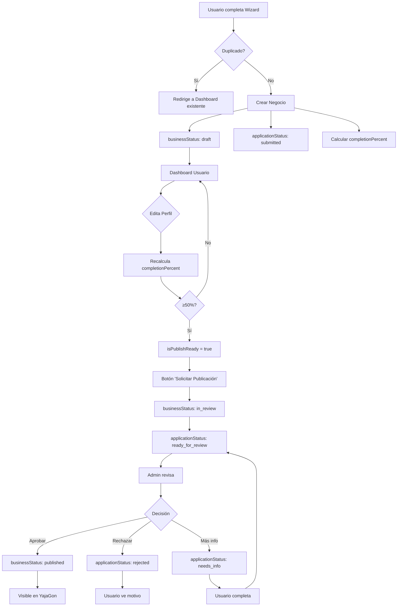

# 📘 Sistema de Estados Dual - Guía Completa

**Versión:** 2.0  
**Fecha:** 10 de Febrero, 2026  
**Autor:** Sistema refactorizado post-migración

---

## 🎯 Visión General

El **Sistema de Estados Dual** separa el ciclo de vida del negocio en dos dimensiones independientes:

1. **`businessStatus`** - Estado de visibilidad y publicación
2. **`applicationStatus`** - Estado del proceso de revisión administrativa

Esta arquitectura elimina los cuellos de botella del sistema anterior donde todo dependía de aprobación manual del admin.

---

## 🔄 Arquitectura del Sistema

### Estados del Negocio (`businessStatus`)

```typescript
type BusinessStatus = 'draft' | 'in_review' | 'published';
```

| Estado | Descripción | Visible Públicamente | Puede Editar Usuario |
|--------|-------------|---------------------|---------------------|
| `draft` | Borrador inicial, negocio en construcción | ❌ No | ✅ Sí |
| `in_review` | Enviado a revisión, esperando admin | ❌ No | ⚠️ Solo campos menores |
| `published` | Publicado y visible en directorio | ✅ Sí | ✅ Sí |

### Estados de la Aplicación (`applicationStatus`)

```typescript
type ApplicationStatus = 
  | 'submitted'          // Enviado inicialmente
  | 'needs_info'         // Admin solicita más información
  | 'ready_for_review'   // Completado y listo para revisar
  | 'approved'           // Aprobado por admin
  | 'rejected';          // Rechazado por admin
```

| Estado | Descripción | Acción del Admin | Siguiente Paso |
|--------|-------------|------------------|----------------|
| `submitted` | Primera solicitud enviada | Revisar | → `needs_info` o `ready_for_review` |
| `needs_info` | Falta información | Esperando usuario | Usuario completa → `ready_for_review` |
| `ready_for_review` | 100% completo, esperando aprobación | Aprobar/Rechazar | → `approved` o `rejected` |
| `approved` | Aprobado oficialmente | - | Negocio publicado |
| `rejected` | No cumple requisitos | - | Fin del ciclo |

---

## 📊 Campos Complementarios

### `completionPercent` (number)
Porcentaje de completitud del perfil (0-100%)

**Cálculo weighted:**
```typescript
{
  name: 10%,           // Obligatorio
  category: 8%,        // Obligatorio
  description: 10%,    // Obligatorio (≥20 chars)
  phone: 10%,          // Obligatorio
  whatsapp: 8%,        // Recomendado
  address: 8%,         // Obligatorio
  colonia: 8%,         // Obligatorio
  location: 8%,        // Obligatorio (lat, lng)
  schedule: 8%,        // Recomendado
  images: 10%,         // Importante (≥1 imagen)
  logo: 6%,            // Nice to have
  cover: 6%            // Nice to have
}
```

### `isPublishReady` (boolean)
Indica si cumple requisitos mínimos para publicación:
- `completionPercent >= 50%`
- Campos obligatorios completos

### `missingFields` (string[])
Array de campos faltantes para llegar al 100%

```json
["logo", "cover", "schedule", "tags"]
```

### `adminNotes` (string)
Notas del administrador cuando solicita más información

### `rejectionReason` (string)
Motivo detallado si el negocio es rechazado

### `lastReviewedAt` (timestamp)
Fecha de última acción del admin

---

## 🔀 Flujo Completo del Sistema



---

## 💼 Casos de Uso

### Caso 1: Nuevo Negocio (Happy Path)

**Paso 1:** Usuario completa wizard
```json
{
  "businessStatus": "draft",
  "applicationStatus": "submitted",
  "completionPercent": 35,
  "isPublishReady": false,
  "missingFields": ["logo", "cover", "images", "schedule"]
}
```

**Paso 2:** Usuario completa perfil en dashboard
```json
{
  "businessStatus": "draft",
  "applicationStatus": "submitted",
  "completionPercent": 75,
  "isPublishReady": true,
  "missingFields": ["logo", "cover"]
}
```

**Paso 3:** Usuario solicita publicación
```json
{
  "businessStatus": "in_review",
  "applicationStatus": "ready_for_review",
  "completionPercent": 75,
  "isPublishReady": true
}
```

**Paso 4:** Admin aprueba
```json
{
  "businessStatus": "published",
  "applicationStatus": "approved",
  "completionPercent": 75,
  "isPublishReady": true,
  "lastReviewedAt": "2026-02-10T10:30:00Z"
}
```

---

### Caso 2: Solicitud Incompleta

**Paso 1-2:** Usuario envía pero falta info
```json
{
  "businessStatus": "in_review",
  "applicationStatus": "ready_for_review",
  "completionPercent": 55,
  "isPublishReady": true,
  "missingFields": ["logo", "cover", "images", "whatsapp"]
}
```

**Paso 3:** Admin solicita más información
```json
{
  "businessStatus": "draft",
  "applicationStatus": "needs_info",
  "completionPercent": 55,
  "adminNotes": "Por favor agrega al menos 3 fotos del negocio y un logo profesional."
}
```

**Paso 4:** Usuario completa y reenvía
```json
{
  "businessStatus": "in_review",
  "applicationStatus": "ready_for_review",
  "completionPercent": 85,
  "isPublishReady": true,
  "missingFields": ["cover"]
}
```

**Paso 5:** Admin aprueba
```json
{
  "businessStatus": "published",
  "applicationStatus": "approved"
}
```

---

### Caso 3: Rechazo

**Admin rechaza** con motivo detallado:
```json
{
  "businessStatus": "draft",
  "applicationStatus": "rejected",
  "completionPercent": 45,
  "rejectionReason": "Las imágenes proporcionadas no son del negocio. Por favor sube fotos reales y verídicas.",
  "lastReviewedAt": "2026-02-10T11:45:00Z"
}
```

Usuario ve banner rojo en dashboard con el motivo y opción de contactar soporte.

---

## 🎨 UI/UX del Sistema

### BusinessStatusBanner Component

Muestra el estado actual con visual adaptativo:

| Estado | Variant | Color | Icono | Acciones |
|--------|---------|-------|-------|----------|
| Draft | `draft` | Gris | 📝 | Completar perfil |
| Needs Info | `warning` | Amarillo | 📝 | Ver notas admin |
| Ready | `info` | Azul | ⏳ | Esperando admin |
| Published | `success` | Verde | ✅ | Ver perfil público |
| Rejected | `error` | Rojo | ❌ | Ver motivo |

**Elementos visuales:**
- 📊 Barra de progreso (0-100%)
- 📋 Lista de campos faltantes
- 🔘 Botones de acción contextuales
- 💬 Notas del admin (si existen)
- ⚠️ Mensajes de error/advertencia

---

## 👨‍💼 Panel de Administración

### 6 Tabs del Sistema Nuevo

#### 1. 🆕 Nuevas Solicitudes
```typescript
applicationStatus === 'submitted'
```
Primera revisión de negocios recién enviados.

#### 2. ⏳ Pendientes
```typescript
applicationStatus === 'needs_info' || 
(isPublishReady === false && completionPercent < 100)
```
Negocios esperando más información o completitud.

#### 3. ✅ Listas para Publicar
```typescript
isPublishReady === true && 
applicationStatus === 'ready_for_review'
```  
Negocios completados esperando aprobación final.

#### 4. 🏪 Publicados
```typescript
businessStatus === 'published'
```
Negocios activos en el directorio.

#### 5. ❌ Rechazados
```typescript
applicationStatus === 'rejected'
```
Negocios que no cumplieron requisitos.

#### 6. 📋 Todos
Sin filtros. Incluye cualquier estado.

### Acciones del Admin

```typescript
// Aprobar
await approveBusiness(businessId);
// → businessStatus: 'published', applicationStatus: 'approved'

// Rechazar
await rejectBusiness(businessId, reason);
// → businessStatus: 'draft', applicationStatus: 'rejected'

// Solicitar info
await requestMoreInfo(businessId, notes);
// → businessStatus: 'draft', applicationStatus: 'needs_info'
```

---

## 🔐 Reglas de Firestore

```javascript
// businesses collection
allow read: if request.auth != null;

allow create: if request.auth != null 
  && request.resource.data.ownerId == request.auth.uid
  && request.resource.data.businessStatus == 'draft'
  && request.resource.data.applicationStatus == 'submitted';

allow update: if request.auth != null 
  && (
    resource.data.ownerId == request.auth.uid  // Owner
    || get(/databases/$(database)/documents/users/$(request.auth.uid)).data.admin == true  // Admin
  )
  && validBusinessStatus()
  && validApplicationStatus();

function validBusinessStatus() {
  return request.resource.data.businessStatus in ['draft', 'in_review', 'published'];
}

function validApplicationStatus() {
  return request.resource.data.applicationStatus in [
    'submitted', 'needs_info', 'ready_for_review', 'approved', 'rejected'
  ];
}
```

---

## 📈 Métricas del Sistema

### Índices Compuestos Requeridos

```json
[
  {
    "collection": "businesses",
    "fields": ["businessStatus", "publishedAt:DESC"]
  },
  {
    "collection": "businesses",
    "fields": ["applicationStatus", "updatedAt:DESC"]
  },
  {
    "collection": "businesses",
    "fields": ["isPublishReady", "completionPercent:DESC"]
  },
  {
    "collection": "businesses",
    "fields": ["ownerId", "createdAt:DESC"]
  }
]
```

### Queries Optimizadas

```typescript
// Negocios publicados (homepage)
db.collection('businesses')
  .where('businessStatus', '==', 'published')
  .orderBy('publishedAt', 'desc')
  .limit(20);

// Nuevas solicitudes (admin)
db.collection('businesses')
  .where('applicationStatus', '==', 'submitted')
  .orderBy('createdAt', 'desc');

// Listas para publicar (admin)
db.collection('businesses')
  .where('isPublishReady', '==', true)
  .where('applicationStatus', '==', 'ready_for_review')
  .orderBy('updatedAt', 'desc');
```

---

## 🚀 Migración de Datos Existentes

Script: `scripts/migrate-business-states.ts`

**Proceso:**
1. Lee negocios sin nuevos campos
2. Mapea estado viejo → nuevo:
   - `status: 'published'` → `businessStatus: 'published'`, `applicationStatus: 'approved'`
   - `status: 'draft'` → `businessStatus: 'draft'`, `applicationStatus: 'submitted'`
   - Sin `status` → `businessStatus: 'draft'`, `applicationStatus: 'submitted'`
3. Calcula `completionPercent` con weighted formula
4. Determina `isPublishReady` (≥50%)
5. Genera `missingFields` array
6. Actualiza Firestore en batch (500 docs/batch)
7. Sincroniza `applications` collection

**Ejecutar:**
```bash
npm run migrate:business-states
```

**Resultado esperado:**
```
✅ 16 negocios migrados
✅ 2 applications migradas
📊 Draft: 9, Published: 7
```

---

## ❓ FAQ - Preguntas Frecuentes

### ¿Por qué dos estados separados?

**Respuesta:** Permite workflows más flexibles:
- Usuario puede editar negocio publicado sin perder visibilidad
- Admin puede solicitar cambios sin despublicar
- Sistema distingue entre "en construcción" y "esperando aprobación"

### ¿Qué pasa si cambio de `published` a `draft`?

**Respuesta:** El negocio deja de ser visible públicamente pero mantiene su data. Usuario puede volver a solicitar publicación.

### ¿Puedo saltarme la revisión del admin?

**Respuesta:** No. Todos los negocios deben pasar por `applicationStatus: 'ready_for_review'` → `approved` antes de publicarse.

### ¿Cómo prevengo duplicados?

**Respuesta:** `createBusinessImmediately()` valida si el usuario ya tiene un negocio registrado:
```typescript
const existing = await db.collection('businesses')
  .where('ownerId', '==', userId)
  .limit(1)
  .get();

if (!existing.empty) {
  return { isDuplicate: true, businessId: existing.docs[0].id };
}
```

---

## 🛠️ Herramientas de Debug

### Verificar estado de un negocio

```typescript
import { computeProfileCompletion } from '@/lib/businessStates';

const business = await getDoc(doc(db, 'businesses', businessId));
const analysis = computeProfileCompletion(business.data());

console.log({
  completionPercent: analysis.completionPercent,
  isPublishReady: analysis.isPublishReady,
  missingFields: analysis.missingFields,
  breakdown: analysis.fieldsBreakdown
});
```

### Recalcular estado manualmente

```typescript
import { updateBusinessState } from '@/lib/businessStates';

const stateUpdate = updateBusinessState(businessData);
await updateDoc(businessRef, stateUpdate);
```

---

## 📚 Referencias

- [ARCHITECTURE.md](./ARCHITECTURE.md) - Diagrama completo del sistema
- [TESTING_CHECKLIST.md](./TESTING_CHECKLIST.md) - QA completo
- [MIGRACION_DATOS_EXISTENTES.md](./MIGRACION_DATOS_EXISTENTES.md) - Guía de migración
- [businessStates.ts](./lib/businessStates.ts) - Funciones core
- [businessActions.ts](./app/actions/businessActions.ts) - Server actions

---

**Última actualización:** 10 de Febrero, 2026  
**Versión del sistema:** 2.0 Post-Migración
